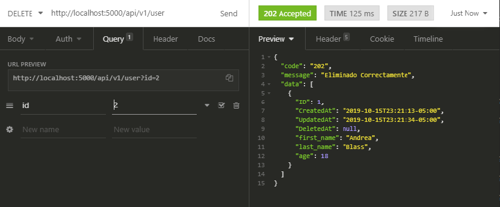

# RestfulAPI
Esta API está escrita en GO y responde a peticiones que se le envian, la aplicación es totalmente RESTful, hace uso de una base de datos MySQL y un ORM.

## Herramientas usadas

- [Go](https://golang.org/) 
- [ORM (GORM)](https://gorm.io/)
- [ECHO (Framework)](https://echo.labstack.com/)
- [MySQL](https://www.mysql.com/)

## Configuración

- configuration.json
```
{
    "server": "localhost",
    "port": "3306",
    "user": "root",
    "password": "root",
    "database": "go_rest"
}
```
Se tiene un archivo para la configuración de la base de datos, la configuración predeterminada corresponde a la dirección 127.0.0.1:3306


La cual tiene una estructura:


La tabla no hace falta crearla porque se migra desde la aplicación

- `db.AutoMigrate(&user{})`


## Compilación y ejecución

- ### Con Docker
Con docker sólo hace falta escribir 2 comandos:
- `$ sudo docker build -t my-golang-app .`
- `$ sudo docker run -it -p 5000:5000 my-golang-app`

Y se desplegara la aplicación corriendo en el puerto 5000


- ### Sin Docker(Windows o mac)
Primero se debe crear una carpeta llamada *TheGolurk* que corresponde a la del proyecto, luego pegar el repositorio allí y por ultimo descargar todas las herramientas con el administrador de paquetes de go
- El [Workspace](https://golang.org/doc/code.html#Workspaces) empieza desde: `C:/go/src/github.com`  

- `$ mkdir TheGolurk`
- `$ cd TheGolurk`
- `$ git clone https://github.com/TheGolurk/RestfulAPI.git`
- `$ go get -u github.com/labstack/echo/...`
- `$ go get -u github.com/jinzhu/gorm`
- `$ go get -u github.com/go-sql-driver/mysql`

- Sin compilar
  `$ go run main.go`
- Compilado y ejecutado
  `$ go build main.go`
  
  `$ ./main`
  
  Al final tanto en windows, docker o mac se deberá mirar la presentación del framework y su puerto
  


## Peticiones
- GET (Traer a un solo usuario)
  - 
  
- GET (Traer todos)
  - 
  
- POST (Crear un usuario)
  - 
  
- PUT (Actualizar un usuario)
  - 
  
- DELETE (Eliminar un usuario)
  - 
